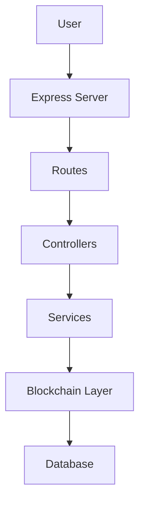
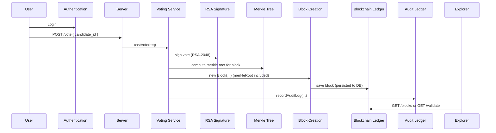
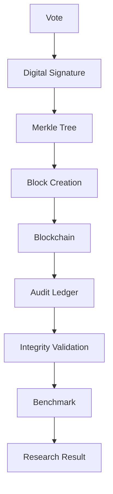

# E‑Voting Integrity & Auditability — Research Implementation

This repository is the implementation artifact of an undergraduate research project that proposes and evaluates mechanisms to improve integrity and auditability in electronic voting systems.

Important: this is a research implementation (thesis / SINTA-oriented), not a production blockchain platform or distributed ledger like Ethereum/Hyperledger. The codebase demonstrates a compact, self-contained pseudo-blockchain integrated with traditional server and relational database components for experimental evaluation.

---

## Research contribution

This work proposes an integrated integrity and auditability mechanism for e-voting using the following primitives:

- Blockchain (custom, application-level ledger persisted to a relational database)
- Merkle Tree (per-block Merkle root computed over transactions)
- RSA Digital Signature (RSA-2048 signatures per voter for authenticity)
- Audit Ledger (separate ledger storing audit actions as signed blocks)

The repository contains an implementation used to validate and benchmark these mechanisms. It demonstrates how signatures, Merkle roots, and block hashes combine to provide layered integrity checks and how an audit ledger can capture administrative actions. The code supports verification (isChainValid) and exploration of stored blocks for research analysis.

This README prioritizes the research contribution and experimental artifacts; implementation and operational details are provided in linked documents.

---

## Technology stack

| Layer | Technology |
|---|---|
| Backend | Node.js |
| Framework | Express.js |
| Database | MySQL (mysql2) |
| Cryptography | RSA-2048 (node crypto / custom helpers) |
| Hash algorithm | SHA-256 (crypto-js) |
| Merkle Tree | Custom implementation (blockchain/merkle.js) |
| Blockchain | Custom pseudo-blockchain (blockchain/blockchain.js) |
| Testing | Jest |
| Benchmark | Custom benchmark framework (benchmark/)


---

## System architecture (high-level)



Brief layer roles:

- User: interacts via browser UI (admin/explorer) or API clients.
- Express Server: exposes HTTP endpoints and serves static assets.
- Routes: map URLs to controller handlers.
- Controllers: adapt HTTP requests to service calls and format responses.
- Services: implement business logic (votingService, auditLogService, candidateLedgerService, etc.).
- Blockchain Layer: Block and Blockchain classes implement Merkle roots, block hashing, and verification logic.
- Database: MySQL stores votes, blocks, audit logs, users and configuration.

---

## Voting workflow (sequence)



---

## Research workflow (experiment flow)



---

## Project layout (concise)

```
/ (repository root)
├─ blockchain/        # Block, Blockchain, Merkle, Keys
├─ config/            # DB and system key helpers
├─ controllers/       # HTTP controllers
├─ services/          # Business logic (votingService, audit, etc.)
├─ routes/            # Express routes
├─ middleware/        # request guards (requireAdmin)
├─ public/            # static UI (admin, explorer)
├─ sql/               # database schema and migrations
├─ benchmark/         # benchmark scripts and results
├─ validation/        # research integrity validation framework
├─ tests/             # Jest tests
└─ server.js
```

Each folder contains the implementation that supports the research experiments and server functionality; detailed operational instructions are placed in the supporting documents linked below.

---

## Documentation & detailed guides

This README provides an overview and research context. Operational and detailed developer instructions are in separate documents:

- Installation & setup: `README_SETUP.md`
- Benchmark framework: `BENCHMARK.md`
- Integrity Validation framework: `VALIDATION.md`
- Testing: `TESTING.md`

Refer to those files for step-by-step commands, configuration details, and interpretation of outputs.

---

## How to run (quick)

1. Install dependencies:
```bash
npm install
```

2. Setup database (see `README_SETUP.md` for full instructions).

3. Start server:
```bash
npm start
# or for development
npm run dev
```

---

## Integrity Validation (research)

A non-destructive Integrity Validation Framework is provided under `validation/`. It is designed for experiments and generates reports. Run:

```bash
node validation/run_integrity_validation.js
```

See `VALIDATION.md` for details about scenarios, reports and interpretation.

---

## Benchmark framework

A benchmark framework is included under `benchmark/` to measure RSA signing, Merkle construction, block creation and blockchain verification. See `BENCHMARK.md` for usage and interpretation.

---

## Testing

Automated tests use Jest. See `TESTING.md` for how to run tests and interpret coverage results.

---

## Citation

If you use this repository for academic purposes, please cite:

Author: [Your Name]
Title: [Thesis / Paper Title]
University: [University Name]
Year: [Year]

(Replace placeholders with actual bibliographic information when available.)

---

## Acknowledgements

- Universitas Dian Nuswantoro
- Faculty of Computer Science
- Information Systems
- Undergraduate Research

---

## License

MIT License

---

## Summary of README sections

1. Research contribution — research-first explanation of goals and primitives used.
2. Technology stack — concise table of technologies actually used.
3. System architecture — mermaid diagram and short descriptions.
4. Voting workflow — sequence diagram of vote processing.
5. Research workflow — experimental flow from vote to research result.
6. Project layout — concise folder tree with one-line purposes.
7. Links to detailed documentation: README_SETUP.md, BENCHMARK.md, VALIDATION.md, TESTING.md.

---

For the next step I will create the supporting documents (BENCHMARK.md, VALIDATION.md, TESTING.md) and ensure `README_SETUP.md` remains present as the installation guide. Proceed if you want me to write those files now.